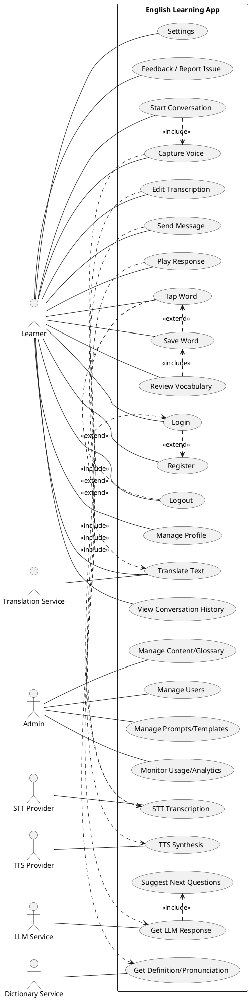

# Use Case Model — Interactive English Learning App

This is a use case model derived from the requirements, plus a few practical additions to improve UX and learning outcomes.

## Scope and actors

- Primary actor: Learner (User)
- Secondary actors (external systems):
  - STT Provider (Speech-to-Text)
  - TTS Provider (Text-to-Speech)
  - LLM Service (e.g., GPT-like)
  - Dictionary/Pronunciation Service
  - Translation Service
- Optional actor: Admin

## Core use cases (User)

- Register / Login / Logout
- Manage Profile (name, email, level, preferences)
- Start Conversation Session
- Capture Voice Input
- Speech-to-Text Transcription
- Edit Transcription (optional)
- Send Message
- Receive LLM Response (context-aware)
- Get Suggested Next Questions
- Play Response via TTS
- Tap Word to View Meaning/Pronunciation
- Translate Selected Text
- Save Word to Personal Wordbook
- Review Vocabulary (flashcards/quiz)
- View Conversation History
- Settings (choose STT/TTS provider, voice, speed, privacy)
- Feedback / Report Issue

## Admin (optional)

- Manage Prompts/Templates (conversation starters, roles)
- Monitor Usage/Analytics
- Manage Users (roles, bans)
- Manage Content/Glossary

## Use case diagram (PlantUML)

## Brief flows (EN)

- Start Conversation
  1) User chooses to start; 2) User speaks; 3) STT transcribes; 4) User optionally edits; 5) User sends; 6) System calls LLM; 7) System shows response and suggested follow-ups; 8) User may play TTS.
- Vocabulary Support
  1) User taps a word; 2) System fetches meaning/pronunciation; 3) Optionally translate; 4) User may save to wordbook; 5) Later review via quiz/flashcards.
- History
  1) User opens history; 2) System displays past sessions and messages; 3) User can resume or review.

## Tóm tắt luồng (VI)

- Bắt đầu hội thoại
  1) Người dùng bắt đầu; 2) Nói tiếng Anh; 3) STT chuyển giọng nói → văn bản; 4) Có thể chỉnh sửa; 5) Gửi; 6) Hệ thống gọi LLM; 7) Hiển thị trả lời và gợi ý câu hỏi tiếp theo; 8) Có thể nghe TTS.
- Hỗ trợ từ vựng
  1) Nhấn vào từ; 2) Hệ thống trả về nghĩa/cách phát âm; 3) Tuỳ chọn dịch; 4) Lưu vào sổ từ; 5) Ôn tập sau qua quiz/flashcards.
- Lịch sử
  1) Mở lịch sử; 2) Xem lại phiên trước; 3) Tiếp tục hoặc xem lại.

## Preconditions / Postconditions (examples)

- Send Message
  - Pre: User authenticated (or guest allowed), transcript available (from STT or manual input)
  - Post: LLM response stored in session; suggestions available; optional TTS ready
- Save Word
  - Pre: A word is selected (from response or transcript)
  - Post: Word saved to user wordbook; available in Review Vocabulary

## Notes

- Settings should allow selecting providers (STT/TTS/LLM), voice, speaking rate, and privacy controls.
- Consider latency budgets: STT < 1–2s, LLM < 2–4s, TTS < 1–2s for smooth UX.
- Provide fallbacks: manual text input if mic/STT fails; text display if TTS fails.
