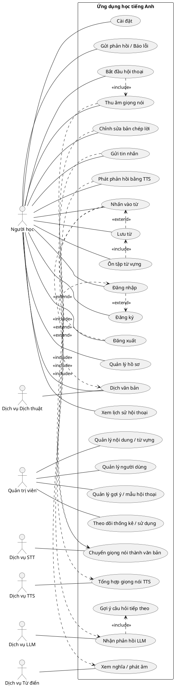

# Mô hình Use Case — Ứng dụng học tiếng Anh tương tác

Đây là mô hình use case được đề xuất từ đặc tả yêu cầu, đồng thời bổ sung một số tính năng thực tế nhằm cải thiện trải nghiệm người dùng (UX) và hiệu quả học tập.

## Phạm vi và tác nhân

- Tác nhân chính: Người học (Người dùng)
- Tác nhân phụ (hệ thống bên ngoài):
  - Dịch vụ STT (Speech-to-Text) - OpenAI Whisper
  - Dịch vụ TTS (Text-to-Speech) - OpenAI TTS
  - Dịch vụ LLM (ví dụ GPT hoặc tương tự) - OpenAI GPT-4o
  - Dịch vụ Từ điển/Phát âm - DictionaryAPI.dev
  - Dịch vụ Dịch thuật - Google Cloud Translation v3 hoặc LLM
- Tác nhân tùy chọn: Quản trị viên (Admin)

## Các use case chính (Người dùng)

- Đăng ký / Đăng nhập / Đăng xuất
- Quản lý hồ sơ (tên, email, cấp độ, tuỳ chọn)
- Bắt đầu một phiên hội thoại
- Thu âm giọng nói
- Chuyển giọng nói thành văn bản (STT)
- Chỉnh sửa bản chép lời (tùy chọn)
- Gửi tin nhắn
- Nhận phản hồi từ LLM (theo ngữ cảnh)
- Nhận gợi ý câu hỏi tiếp theo
- Phát phản hồi bằng TTS
- Nhấn vào từ để xem nghĩa/ phát âm
- Dịch văn bản được chọn
- Lưu từ vào sổ tay cá nhân
- Ôn tập từ vựng (flashcards/quiz)
- Xem lại lịch sử hội thoại
- Cài đặt (chọn STT/TTS, giọng, tốc độ, quyền riêng tư)
- Gửi phản hồi / Báo lỗi

## Quản trị viên (tùy chọn)

- Quản lý gợi ý/mẫu hội thoại (prompts/templates)
- Theo dõi thống kê/analytics
- Quản lý người dùng (vai trò, khóa tài khoản)
- Quản lý nội dung/từ vựng/từ điển

## Sơ đồ Use Case (PlantUML)

## Brief flows (EN)

- Start Conversation
  1) User chooses to start; 2) User speaks; 3) STT transcribes; 4) User optionally edits; 5) User sends; 6) System calls LLM; 7) System shows response and suggested follow-ups; 8) User may play TTS.
- Vocabulary Support
  1) User taps a word; 2) System fetches meaning/pronunciation; 3) Optionally translate; 4) User may save to wordbook; 5) Later review via quiz/flashcards.
- History
  1) User opens history; 2) System displays past sessions and messages; 3) User can resume or review.

## Tóm tắt luồng (VI)

- Bắt đầu hội thoại
  1) Người dùng bắt đầu; 2) Nói tiếng Anh; 3) STT chuyển giọng nói → văn bản; 4) Có thể chỉnh sửa; 5) Gửi; 6) Hệ thống gọi LLM; 7) Hiển thị trả lời và gợi ý câu hỏi tiếp theo; 8) Có thể nghe TTS.
- Hỗ trợ từ vựng
  1) Nhấn vào từ; 2) Hệ thống trả về nghĩa/cách phát âm; 3) Tuỳ chọn dịch; 4) Lưu vào sổ từ; 5) Ôn tập sau qua quiz/flashcards.
- Lịch sử
  1) Mở lịch sử; 2) Xem lại phiên trước; 3) Tiếp tục hoặc xem lại.

## Preconditions / Postconditions (ví dụ)

- Gửi tin nhắn
  - Pre: Người dùng đã xác thực (hoặc cho phép khách), có văn bản từ STT hoặc nhập thủ công.
  - Post: Phản hồi LLM được lưu vào phiên; có gợi ý câu hỏi; TTS sẵn sàng (nếu chọn).
- Lưu từ vựng
  - Pre: Đã chọn một từ (từ phản hồi hoặc bản hội thoại).
  - Post: Từ được lưu vào sổ tay; xuất hiện trong phần Ôn tập từ vựng.

## Ghi chú

- Mục Cài đặt nên cho phép chọn nhà cung cấp (STT/TTS/LLM), giọng đọc, tốc độ nói và quyền riêng tư.
- Lưu ý độ trễ để trải nghiệm mượt: STT < 1–2s, LLM < 2–4s, TTS < 1–2s.
- Có phương án dự phòng: cho phép nhập văn bản nếu mic/STT lỗi; hiển thị văn bản nếu TTS lỗi.
